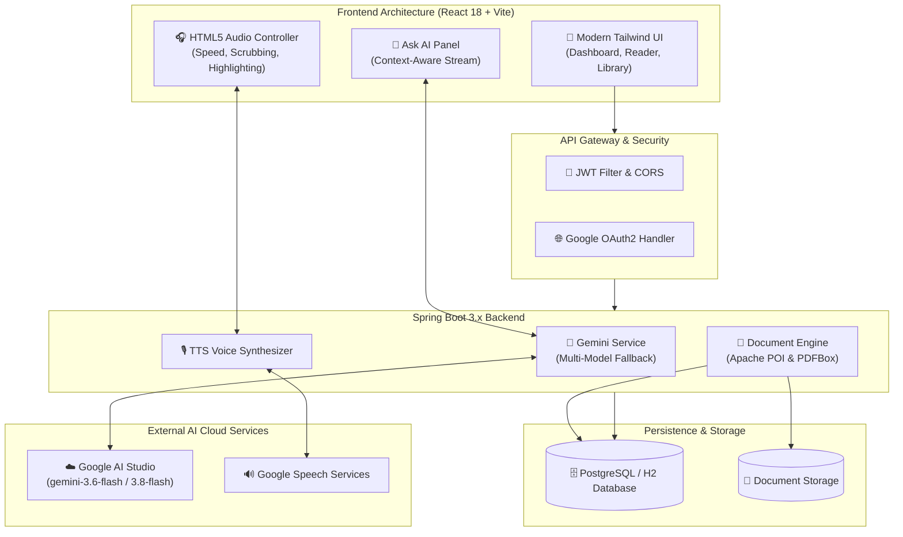

<div align="center">

# 🎙️ DocVoice
### *The Next-Gen Multilingual Document-to-Speech & AI Knowledge Platform*

Transform static documents into interactive audiobooks and conversational AI knowledge hubs.

[](https://www.oracle.com/java/)
[](https://spring.io/projects/spring-boot)
[](https://react.dev/)
[](https://vitejs.dev/)
[](https://ai.google.dev/)
[](https://tailwindcss.com/)
[](https://opensource.org/licenses/MIT)

<br/>

[Explore Docs](#-getting-started) • [Report Bug](https://github.com/Amitesh-cyber/docvoice-/issues) • [Request Feature](https://github.com/Amitesh-cyber/docvoice-/issues)

</div>

---

## ⚡ Overview

**DocVoice** bridges the gap between passive reading and auditory learning. Whether you are consuming 100-page academic PDFs, complex financial reports, or classroom PowerPoint slides, DocVoice ingests your files, generates intelligent summaries, and synthesizes studio-grade audio in **50+ global and regional languages** with real-time text tracking.

### 🌟 Key Value Highlights:
- 📖 **Multimodal Parsing**: Seamless extraction from **PDF**, **DOCX**, and **PPT/PPTX** presentations (including tables, nested shapes, and multi-slide decks).
- 🧠 **Dual-Core Gemini AI Intelligence**: Instant page-by-page bullet points, document summarization, and interactive **"Ask AI"** Q&A with conversational context.
- 🗣️ **Multilingual Text-to-Speech (TTS)**: Listen on the go in English, Spanish, French, German, and major Indian languages (Hindi, Tamil, Telugu, Bengali, Marathi, etc.).
- 🛡️ **Failover Resilience**: Enterprise-grade model fallback architecture (`gemini-3.6-flash` ⇄ `gemini-3.8-flash`) ensuring zero downtime during API traffic surges.
- 🔒 **Stateless Security**: Spring Security 6, JWT bearer tokens, and Google OAuth2 Social Sign-On.

---

## 🛠️ System Architecture



---

## 💻 Tech Stack & Tooling

| Domain | Technology | Description |
| :--- | :--- | :--- |
| **Frontend** | React 18, Vite, Tailwind CSS, Lucide Icons | Responsive SPA, instant hot-reloading, modern dark/light UI |
| **Backend** | Java 17, Spring Boot 3.x, Spring Data JPA | High-throughput REST API with clean layer separation |
| **Document Processing** | Apache POI 5.x, Apache PDFBox 3.x | Deep extraction of slides, tables, formatted text, and metadata |
| **AI & LLM** | Google Gemini (3.6-Flash / 3.8-Flash) | Context-grounded Q&A, executive summaries, multi-key retry |
| **Speech Engine** | Google Text-to-Speech Engine | Natural pitch, sentence pacing, 50+ language synthesis |
| **Database** | PostgreSQL (Prod) / H2 (Dev) | Relational persistence for users, documents, and notes |
| **Auth** | Spring Security 6, JWT, OAuth2 | Cryptographically signed bearer tokens, Google SSO |

---

## 🚀 Getting Started

Follow these steps to run DocVoice locally on your machine.

### 1. Prerequisites
- **Java JDK 17+** installed ([Download](https://www.oracle.com/java/technologies/downloads/))
- **Node.js 18+** & `npm` installed ([Download](https://nodejs.org/))
- **Google Gemini API Key** ([Get Free Key](https://aistudio.google.com/))

---

### 2. Backend Setup

```bash
# Clone the repository
git clone https://github.com/Amitesh-cyber/docvoice-.git
cd docvoice-/backend

# Configure local development environment
# (Keys are securely managed via application-local.yml or environment variables)
export GEMINI_KEY_1="your_gemini_api_key"
export JWT_SECRET="your_custom_jwt_secret_key_32_characters"

# Build and run the Spring Boot service
./mvnw spring-boot:run
```
> *The backend server will launch at: `http://localhost:8080`*

---

### 3. Frontend Setup

```bash
# In a new terminal, navigate to frontend
cd docvoice-/frontend

# Install dependencies
npm install

# Start the Vite development server
npm run dev
```
> *Open your browser at: `http://localhost:5173`*

---

## 📋 API Endpoints Reference

### Authentication
- `POST /api/auth/register` — Create a new DocVoice account
- `POST /api/auth/login` — Authenticate and receive JWT Bearer token
- `GET /oauth2/authorize/google` — Authenticate via Google OAuth2

### Document Management
- `POST /api/documents/upload` — Upload PDF, DOCX, or PPT/PPTX file (Multipart)
- `GET /api/documents` — Fetch all user uploaded documents
- `GET /api/documents/{id}` — Fetch document details and page structures
- `DELETE /api/documents/{id}` — Delete document and stored media

### AI & Reader Controls
- `GET /api/reader/document/{id}/pages` — Fetch paginated extracted content
- `POST /api/reader/ask` — Context-grounded Q&A ("Ask AI" panel)
- `GET /api/reader/audio?lang={code}&text={query}` — Stream audio synthesis

---

## 🌐 Production Cloud Deployment

### 1. Frontend on Vercel (Free)
1. Fork or import this repo into **[Vercel](https://vercel.com)**.
2. Select the `frontend` folder as the **Root Directory**.
3. Add Environment Variable:
   ```env
   VITE_API_BASE_URL=https://your-backend.onrender.com
   ```
4. Click **Deploy**.

### 2. Backend on Render (Free)
1. Create a **New Web Service** on **[Render](https://render.com)**.
2. Connect your `Amitesh-cyber/docvoice-` GitHub repository.
3. Configure settings:
   - **Root Directory**: `backend`
   - **Build Command**: `./mvnw clean package -DskipTests`
   - **Start Command**: `java -jar target/demo-0.0.1-SNAPSHOT.jar`
4. Add Environment Variables:
   - `GEMINI_KEY_1`: `<your-gemini-key>`
   - `GEMINI_KEY_2`: `<your-backup-key>`
   - `JWT_SECRET`: `<your-32-char-jwt-secret>`

---

## 💼 Resume / CV Showcase Points

*Ready to copy-paste directly into your resume under the **Projects** section:*

```text
DocVoice — Multilingual Document-to-Speech & AI Knowledge Platform
Tech Stack: Java 17, Spring Boot 3, React 18, Google Gemini AI, PostgreSQL, Tailwind CSS, Docker

• Built an end-to-end full-stack document intelligence platform parsing PDFs, Word documents, and PPT/PPTX slides using Apache POI and PDFBox with recursive shape/table extraction.
• Implemented Google Gemini (3.6/3.8 Flash) for page-by-page AI summaries and contextual Q&A, designing an automatic multi-model failover engine mitigating 503 high-demand rate limits.
• Integrated multilingual Text-to-Speech (TTS) audio streaming in 50+ languages with synchronized paragraph tracking and playback speed scrubbing.
• Secured application using Spring Security 6 with stateless JWT authorization, Google OAuth2 SSO, and role-based access control.
• Automated CI/CD workflows and deployed the web client to Vercel and containerized REST API to cloud infrastructure.
```

---

## 🤝 Contributing

Contributions are what make the open-source community an incredible place to learn, inspire, and create.
1. **Fork** the project
2. **Create** your feature branch (`git checkout -b feature/AmazingFeature`)
3. **Commit** your changes (`git commit -m 'feat: Add some AmazingFeature'`)
4. **Push** to the branch (`git push origin feature/AmazingFeature`)
5. **Open** a Pull Request

---

## 📄 License

Distributed under the **MIT License**. See [`LICENSE`](LICENSE) for more information.

<div align="center">
  <sub>Built with ❤️ by <a href="https://github.com/Amitesh-cyber">Amitesh</a></sub>
</div>
