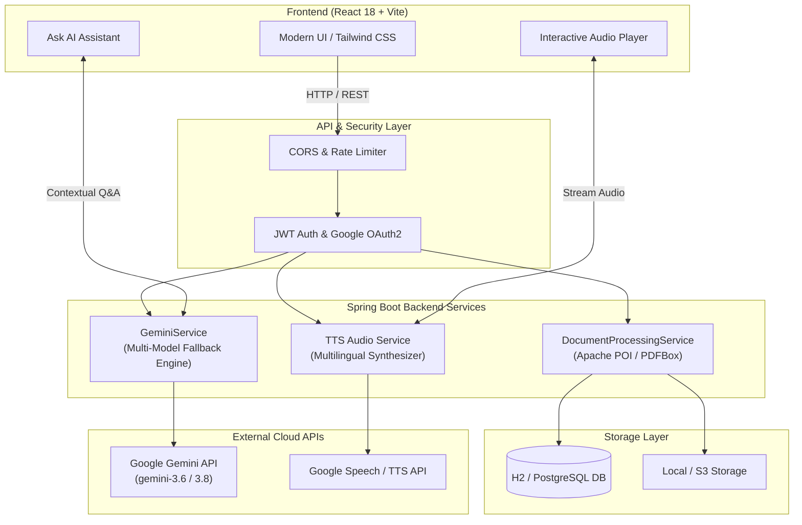

# 🎙️ DocVoice — Multilingual Document-to-Speech & AI Knowledge Assistant

[](https://spring.io/projects/spring-boot)
[](https://react.dev/)
[](https://www.oracle.com/java/)
[](https://ai.google.dev/)
[](https://tailwindcss.com/)
[](LICENSE)

> **DocVoice** is a modern, full-stack AI platform that transforms static documents (PDF, DOCX, PPT, PPTX) into interactive audio listening experiences and conversational knowledge hubs. Designed for accessibility, multi-tasking learners, and multilingual audiences.

---

## 🌟 Key Highlights & Features

- **📑 Multi-Format Document Ingestion**:
  - High-precision extraction for **PDF** (Apache PDFBox), **PPT / PPTX** (Apache POI with recursive shape & table decomposition), and **DOCX**.
  - Resilient against corrupted archives, ZIP data descriptors, and nested presentation elements.
- **🤖 Dual-Model Gemini AI Engine**:
  - Instant page-by-page and document-level structured summaries.
  - Contextual **"Ask AI" Q&A** allowing users to query document contents in real time.
  - Fault-tolerant AI failover: automatic fallback and retry architecture (`gemini-3.6-flash` ⇄ `gemini-3.8-flash`) to ensure 99.9% uptime against traffic surges.
- **🎧 Multilingual Text-to-Speech (TTS)**:
  - Natural speech synthesis supporting 50+ languages, including regional Indian languages (Hindi, Tamil, Telugu, Bengali, Marathi, etc.).
  - Interactive playback controls: speed adjustments, paragraph scrubbing, and synchronized reading highlights.
- **🔐 Enterprise-Grade Security**:
  - Stateless authentication with **JWT (JSON Web Tokens)** and **Google OAuth2 SSO**.
  - Granular CORS policies, encrypted credential handling, and isolated per-user document storage.
- **⚡ Modern Responsive UI**:
  - Built with **React 18**, **Vite**, and **Tailwind CSS**.
  - Document library manager, reader mode, floating audio player bar, and AI chat side-panel.

---

## 🏗️ System Architecture



---

## 📁 Repository Structure

```text
docvoice/
├── backend/                        # Spring Boot REST API
│   ├── src/main/java/com/example/demo/
│   │   ├── controller/             # REST Endpoints (Auth, Documents, Reader, Test)
│   │   ├── service/                # Core Logic (GeminiService, DocumentProcessingService, TTS)
│   │   ├── repository/             # Spring Data JPA Repositories
│   │   ├── model/                  # JPA Entities (User, Document, Page, Summary)
│   │   └── security/               # JWT Authentication & OAuth2 Configuration
│   ├── src/main/resources/
│   │   ├── application.yml         # Application configuration & AI settings
│   │   └── application-prod.yml    # Production profile
│   └── pom.xml                     # Maven dependencies
├── frontend/                       # React 18 + Vite Client
│   ├── src/
│   │   ├── components/             # Reusable UI (AudioPlayer, Navbar, ChatDrawer)
│   │   ├── pages/                  # Views (Dashboard, Reader, Login, Upload)
│   │   ├── context/                # Auth & Player State Management
│   │   └── services/               # Axios API client
│   ├── package.json
│   └── vite.config.js
├── .github/workflows/              # CI/CD pipelines
├── docker-compose.yml              # Local orchestration (Postgres / App)
├── .gitignore                      # Git exclusion rules
└── README.md                       # Project documentation
```

---

## 🚀 Quick Start (Local Setup)

### 1. Prerequisites
- **Java**: 17 or higher
- **Node.js**: 18 or higher & `npm`
- **Gemini API Key**: Free key from [Google AI Studio](https://aistudio.google.com/)

---

### 2. Backend Setup
1. Navigate to the backend folder:
   ```bash
   cd backend
   ```
2. Set your environment variables (or configure `application.yml`):
   ```bash
   # Windows PowerShell
   $env:GEMINI_KEY_1="your_gemini_api_key"
   $env:JWT_SECRET="your_jwt_secret_min_32_characters"

   # Linux / macOS
   export GEMINI_KEY_1="your_gemini_api_key"
   export JWT_SECRET="your_jwt_secret_min_32_characters"
   ```
3. Run using Maven wrapper:
   ```bash
   # Windows
   .\mvnw spring-boot:run

   # Linux / macOS
   ./mvnw spring-boot:run
   ```
   *The backend starts at `http://localhost:8080`.*

---

### 3. Frontend Setup
1. Navigate to the frontend folder:
   ```bash
   cd frontend
   ```
2. Install dependencies:
   ```bash
   npm install
   ```
3. Start the development server:
   ```bash
   npm run dev
   ```
   *The client starts at `http://localhost:5173`.*

---

## 🌐 API Reference Overview

| Method | Endpoint | Description | Auth Required |
| :--- | :--- | :--- | :---: |
| `POST` | `/api/auth/register` | Register a new user account | No |
| `POST` | `/api/auth/login` | Login and obtain JWT bearer token | No |
| `GET` | `/api/documents` | Retrieve all user documents | Yes |
| `POST` | `/api/documents/upload` | Upload and process PDF/DOCX/PPTX | Yes |
| `GET` | `/api/reader/document/{id}/pages`| Fetch parsed document pages | Yes |
| `POST` | `/api/reader/ask` | Ask AI context-grounded question | Yes |
| `GET` | `/api/reader/audio` | Stream synthesized audio by paragraph | No |

---

## 🚢 Deploying to Production (Making It Live)

Deploying DocVoice live makes it an impressive, interactive item on your CV:

### Frontend Deployment (Vercel / Netlify - Free)
1. Push your code to GitHub.
2. Log into [Vercel](https://vercel.com) and click **Add New Project**.
3. Import your GitHub repository and set the **Root Directory** to `frontend`.
4. Add environment variable:
   ```env
   VITE_API_BASE_URL=https://your-backend-service.onrender.com
   ```
5. Click **Deploy**.

### Backend Deployment (Render / Railway / Fly.io - Free/Low Cost)
1. In [Render](https://render.com), select **New Web Service** and connect your repository.
2. Set **Root Directory** to `backend`.
3. Build Command: `./mvnw clean package -DskipTests`
4. Start Command: `java -jar target/*.jar`
5. Configure Environment Variables in the Render dashboard:
   - `GEMINI_KEY_1`: `<your-key>`
   - `JWT_SECRET`: `<secure-random-string>`
   - `SPRING_PROFILES_ACTIVE`: `prod`

---

## 💼 CV / Resume Showcase Guide

When adding this project to your CV, emphasize full-stack architecture, AI integration, and problem solving:

```markdown
**DocVoice — Multilingual Document-to-Speech & AI Assistant (Full Stack)**
- Built a full-stack document intelligence platform supporting PDF, DOCX, and PPTX with Apache POI, PDFBox, and Spring Boot 3.
- Integrated Google Gemini AI for real-time document summarization and interactive Q&A, designing a resilient multi-model failover mechanism that mitigated API rate limits and 503 outages.
- Implemented high-performance multilingual text-to-speech audio streaming supporting 50+ languages with synchronized reading highlights.
- Architected stateless authentication using Spring Security 6, JWT, and OAuth2 SSO with role-based access control.
- Deployed frontend to Vercel and backend to cloud containers with CI/CD automation via GitHub Actions.
```

---

## 🤝 Contributing

Contributions, issues, and feature requests are welcome!
1. Fork the Project
2. Create your Feature Branch (`git checkout -b feature/AmazingFeature`)
3. Commit your Changes (`git commit -m 'Add some AmazingFeature'`)
4. Push to the Branch (`git push origin feature/AmazingFeature`)
5. Open a Pull Request

---

## 📄 License

Distributed under the **MIT License**. See `LICENSE` for more information.
